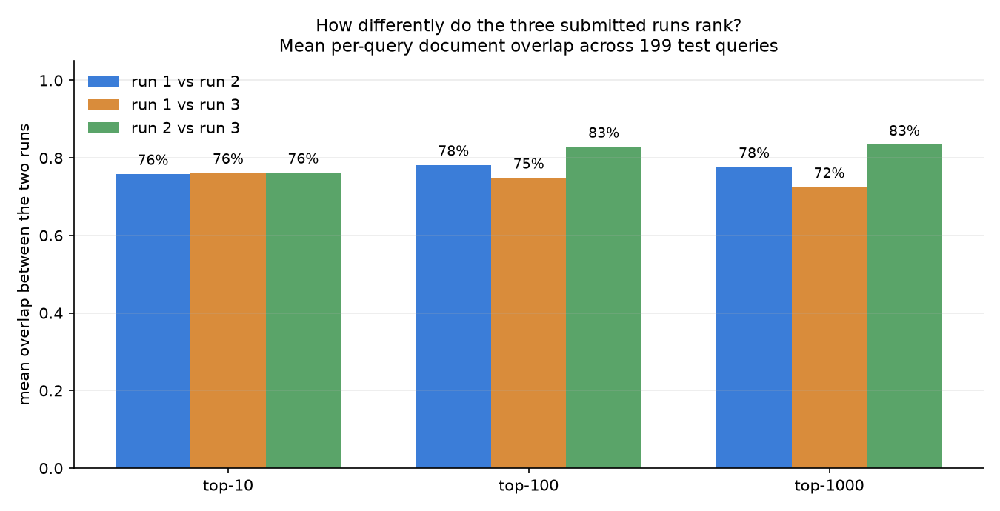

# Academic Projects

Selected coursework from my **Data Engineering** studies at the **Technion**, consolidated into one repository.

These are course projects, presented honestly as course projects — not production systems. What they show is breadth across the data stack, and in a few cases a result worth arguing about. My production work lives in separate repositories: **[ScalpelLab](https://github.com/razbenaharon/ScalpelLab)** (surgical video research infrastructure) and **[owc-lto8-archiver](https://github.com/razbenaharon/owc-lto8-archiver)** (LTO-8 tape archival with a PostgreSQL catalog).

---

## The projects

| Project | Area | The problem | Headline result |
|---|---|---|---|
| **[active-learning](active-learning/)** | Machine Learning | Buy 5,000 labels from an oracle to maximise F1 on a rare class, with a frozen model and a frozen threshold | **F1 0.6471**, up from 0.4068 |
| **[surgical-tool-detection](surgical-tool-detection/)** | Computer Vision | Detect hands and instruments from ~61 labeled images, generalise to out-of-distribution surgery video | **mAP@50-95 0.809**; pseudo-labelling *hurt* OOD |
| **[wikipedia-hybrid-retrieval](wikipedia-hybrid-retrieval/)** | Information Retrieval | Rank Wikipedia pages for natural-language questions under a query-time budget | Hybrid: 0.60 semantic / 0.30 lead-BM25 / 0.10 coverage |
| **[map-optimization-ir](map-optimization-ir/)** | Information Retrieval | Maximise MAP on TREC Robust with a fixed Indri index | **MAP 0.2373** via cross-model PRF expansion |
| **[match-point](match-point/)** | Data Engineering | Rank accommodation for football tourists, where proximity to a fixture beats generic value | Scraping → LLM enrichment → PySpark ranking → interactive map |
| **[distributed-database-spark](distributed-database-spark/)** | Data Engineering | Segment TV households and characterise what each segment watches, in batch and on a stream | K-Means (k=8) + Kafka Structured Streaming |
| **[foodflow](foodflow/)** | AI Agents | Decide cook / sell / donate for a restaurant's expiring stock | Six-agent LLM system over a Qdrant recipe index |

## Results worth a second look

The numbers above are the easy part. These are the findings I would actually want to talk about:

**Removing stopwords cut retrieval effectiveness nearly in half.** In the [IR challenge](map-optimization-ir/), stripping stopwords from queries — textbook preprocessing — dropped MAP from ~0.23 to ~0.12. The provided index had been built *with* stopwords retained, so a routine cleaning step created a vocabulary mismatch across the two sides of the match. Preprocessing has to agree with the index it queries, not with general good practice.

**Semi-supervised learning made the model worse where it mattered.** In [surgical tool detection](surgical-tool-detection/), pseudo-labelling lifted in-distribution validation (mAP@50-95 0.809 → 0.837) while *degrading* performance on the out-of-distribution video the system actually had to handle — classic confirmation bias, the model reinforcing its own errors. The supervised baseline was submitted as final. Choosing the model that scored lower on the visible metric was the whole exercise.

**The metric dictated the strategy, not the other way round.** [Active learning](active-learning/) was graded on F1 for a minority class at a threshold the grader would not let us tune. Two consequences followed directly: only positives score, so hunting for them beat uncertainty sampling (+0.028); and with the threshold frozen, the only remaining lever on precision/recall was training composition — duplicating each positive once was worth +0.054, the single largest gain in the project.

**A hybrid that actually diverges.** The [IR runs](map-optimization-ir/) were checked for whether the three submitted models rank differently at all, or merely look different. Any two share about three quarters of each query's results, and the hybrid is the *least* similar to the BM25 baseline it is built on.

## Technologies

| | |
|---|---|
| **ML / CV** | PyTorch, YOLOv11, scikit-learn, semi-supervised pseudo-labelling |
| **IR** | Indri, BM25, Dirichlet smoothing, pseudo-relevance feedback, sentence-transformers (MiniLM) |
| **Data engineering** | Apache Spark / PySpark, Kafka Structured Streaming, Databricks, Parquet |
| **LLM systems** | LangChain, Llama 3.3 70B, Azure OpenAI, Qdrant vector search |
| **Collection** | BeautifulSoup, residential proxy scraping |

## Reproducibility, honestly

Most of these depend on course-provided data that cannot be redistributed, and several were written for Databricks. Rather than imply otherwise, each project states what it needs:

| Project | Runs from a clone? |
|---|---|
| active-learning | With the course `data/` and `constants.yaml` in place |
| surgical-tool-detection | Yes — weights are a release asset; see [`REPRODUCE.md`](surgical-tool-detection/REPRODUCE.md) |
| wikipedia-hybrid-retrieval | Needs the Wikipedia corpus; `scripts/build_index.py` rebuilds the ~250 MB index |
| map-optimization-ir | Results and method only — the Indri index and driver scripts were not part of the submission. `analyze_runs.py` runs on the committed run files |
| match-point | No — Databricks `/dbfs` paths and a Llama serving endpoint |
| distributed-database-spark | No — Databricks mounts and a course Kafka topic |
| foodflow | With Azure OpenAI and Qdrant credentials in the environment |

No result in this repository was regenerated or estimated for presentation. Every figure quoted comes from the original submission, and where a number was never recorded — the Wikipedia project's NDCG@10 — it is left unquoted rather than invented.

## About this repository

Each project was migrated from its original standalone repository during a portfolio cleanup. The migration intentionally used clean current project files rather than importing the full histories, which kept the consolidated repository focused, portable, and free of legacy repository-specific metadata.

Cleanup was limited to packaging and presentation. Code, results and outputs remain faithful to the original submissions; where notebook prose or generated metadata was cleaned up, the relevant project README documents it. Team members are credited in each project's README.

Two projects carry their original standalone licence (`distributed-database-spark`, Apache-2.0; `map-optimization-ir`, MIT). The repository as a whole is not otherwise licensed.